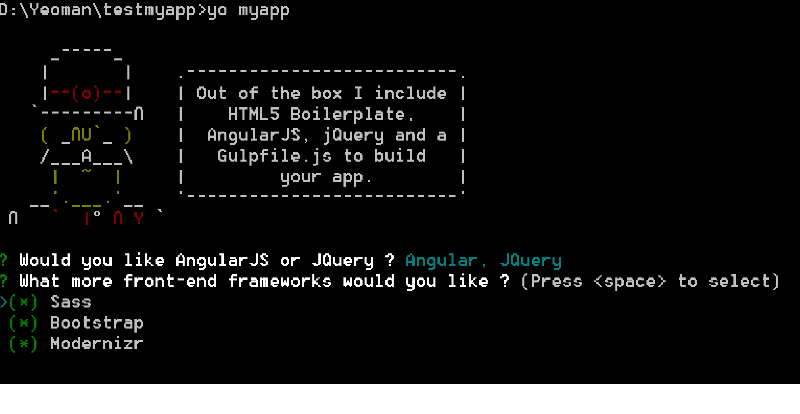

Generator that scaffolds out a front-end web app for AngularJS, JQuery, Modernizr, Bootstrap, SASS and the mocha-test framework.

## Features

Please see the [gulpfile.js](generators/app/templates/gulpfile.js) for up to date information on what we support.

*	CSS Autoprefixing: a postprocessor for CSS appropriate for all  browsers.
*	Automagically compile Sass/.scss files with [libsass](http://libsass.org)
*	Minifies all your .css and .js files and html-files
*	Map compiled CSS to source stylesheets with source maps
*	Built-in preview server with BrowserSync. BowerSync watch all files and update connected browsers if a change occurs in your 
*	Automagically lint your scripts via jshint
*	Image optimization
*	Automagically wire-up dependencies installed with [Bower](http://bower.io)
*	Inject [Bower](http://bower.io) components to your HTML/SCSS files via the wiredep task.
*   Support for AngularJS, JQuery, Modernizr, Bootstrap, SASS and the mocha-test framework
*	Use the .tmp directory mostly for compiling assets like SCSS files. It has precedence over app, so if you had an app/index.html template compiling to .tmp/index.html, your application would point to .tmp/index.html, which is what we want.

*For more information on what this generator can do for you, take a look at the [gulp plugins](generator/app/templates/_package.json) used in our `package.json`.*

## Getting Started

- Install dependencies: `npm install --global yo bower`
- Install the generator: `npm install --global generator-myapp`
- Run in the root folder of the generator-myapp : `npm link`
- Run `yo myapp` to scaffold your webapp
- Run `gulp serve` to preview and watch for changes
- Run `bower install --save <package>` to install frontend dependencies
- Run `gulp` to build your webapp for production

## Options

- `--skip-welcome-message`
  Skips Yeoman's greeting before displaying options.
- `--skip-install-message`
  Skips the message displayed after scaffolding has finished and before the dependencies are being installed.
- `--skip-install`
  Skips the automatic execution of `bower` and `npm` after scaffolding has finished.
- `--test-framework=<framework>`
  Defaults to `mocha`. Can be switched for another supported testing framework like `jasmine`.

## License

[BSD license](http://opensource.org/licenses/bsd-license.php)
